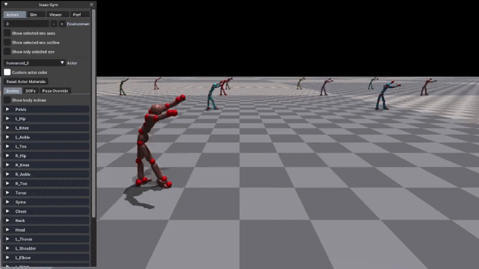

# Puffer PHC

This is a simplified version of the [Perpetual Humanoid Control](https://github.com/ZhengyiLuo/PHC) repository. The class inheritance and dependencies have been greatly reduced, and [PufferLib](https://github.com/PufferAI/PufferLib) is used to train the policy. Thank you to [Zhengyi Luo](https://github.com/ZhengyiLuo) for the awesome research and open sourcing the code. 

This project was sponsored by [Puffer AI](https://puffer.ai/). If you like what you see, please contact [Puffer AI for priority service](https://puffer.ai/product.html).

This repo implements only the single primitive model, which can perform 99.0% of the AMASS 11313 motions. See the [wandb log](https://wandb.ai/kywch/pufferlib/runs/morph-93bb6039) for training details.

<div float="center">
  
</div>

## Getting Started

1. Clone this repository. 
    ```
    git clone https://github.com/kywch/puffer-phc.git
    ```
    Then, go to the cloned directory.
    ```
    cd puffer-phc
    ```

2. Using pixi, setup the virutal environment and install the dependencies. Install pixi, if you haven't already. See [pixi documentation](https://pixi.sh/latest/#installation) for more details. The following command is for linux.
    ```
    curl -fsSL https://pixi.sh/install.sh | bash
    ```

    The following command installs the dependencies and activate the virtual environment:
    ```
    pixi shell
    ```

3. Install Isaac Gym and gymtorch. Download and unzip Isaac Gym from [here](https://developer.nvidia.com/isaac-gym). Then. install isaacgym by running the following command inside the virtual environment:
    ```
    cd <isaac gym directory>/python
    pip install -e .
    ```

    Also, install gymtorch by running the following command inside the repository directory:
    ```
    pixi run build_gymtorch
    ```
    This gymtorch allows you to debug the isaac gym env inside VSCode.
    

    You can test if the installation is successful by running:
    ```
    pixi run test_deps
    ```

4. Download the SMPL parameters from [SMPL](https://smpl.is.tue.mpg.de/), and unzip them into `smpl` folder. Rename the files `basicmodel_neutral_lbs_10_207_0_v1.1.0`, `basicmodel_m_lbs_10_207_0_v1.1.0.pkl`, `basicmodel_f_lbs_10_207_0_v1.1.0.pkl` to `SMPL_NEUTRAL.pkl`, `SMPL_MALE.pkl` and `SMPL_FEMALE.pkl`.

5. Train a policy. In the virtual environment, run:
    ```
    python scripts/train.py --config config.ini -m <MOTION FILE PATH>
    ```

    The script supports wandb logging. To use wandb, log in to wandb, then add `--track` to the command.

    To prepare your own motion data, please see the `convert_amass_data.py` script in the `scripts` folder. After conversion, you can visually inspect the data with the `vis_motion_mj.py` script.

6. Play the trained policy. In the virtual environment, run:
    ```
    python scripts/train.py --mode play -c <CHECKPOINT PATH> 
    ```

    For batch evaluation (e.g., using 4096 envs to evaluate AMASS 11313 motions), run:
    ```
    python scripts/train.py --mode eval -c <CHECKPOINT PATH>
    ```

7. Sweep the hyperparameters using CARBS.
    ```
    python scripts/train.py --config config.ini --mode sweep
    ```

    To adjust the sweep parameters and range, edit the `config.ini` file. You might need to comment/uncomment some parts in the `train.py` script, `sweep_carbs()` function to make the sweep work.


# Notes
* `python scripts/train.py --help` shows the full list of options for the environment and training, which allows you to override the defaults in the config file.
* I tested the [style discriminator](https://arxiv.org/abs/2104.02180) in the original PHC repo and here, saw that it did not improve the imitation performance, so turned it off in the config. To enable it, set `use_amp_obs` to True in the config, or add `--use-amp-obs True` to the command.
* I saw several times that "fine-tuning" pretrained weights with `-c <CHECKPOINT PATH>` resulted in much faster learning. The [L2 init reg loss](https://arxiv.org/abs/2308.11958) is being logged in the wandb dashboard, and you can see greater L2 distance when learning from scratch compared to fine-tuning.
* As mentioned in the [PHC paper](https://arxiv.org/abs/2305.06456), I saw that the 6-layer MLP perform better than shallow MLPs, and SiLU activations perform better than ReLUs.
* Adding LayerNorm before the last layer tamed the gradient norm, and I [swept the hyperparameters](https://wandb.ai/kywch/carbs/sweeps/fupc0sps?nw=nwuserkywch) with the max grad norm of 10 (the original PHC repo uses 50). 
* Observations are RMS normalized, but the rewards/values are not. The gamma was set to 0.98 to manage the value loss. The hyperparameter sweeps consistently converged to small lambda values, so I chose 0.2.
* Also, the sweeps consistently converged to very aggressive clip coefs (0.01) and higher learning rates. I speculate that since the trainer uses the same learning rate for both actor and critic, it's using actor clipping to slow down the actor learning relative to the critic.
* I tried using LSTM for both the actor and critic, respectively, and it didn't work better. These LSTM policies are included in the code, so feel free to try them.


# References
This repository is built on top of the following amazing repositories:

* Main PHC code, motion lib, poselib, and data scripts are from: [PHC](https://github.com/ZhengyiLuo/PHC) and [Isaac Gym](https://developer.nvidia.com/isaac-gym)
* The PPO and CARBS sweep code is from: [PufferLib](https://github.com/PufferAI/PufferLib)
* Sample motion data is from: [CMU Motion Capture Dataset](http://mocap.cs.cmu.edu/), Subject 5, Motion 6 

Please follow the license of the above repositories for usage.
